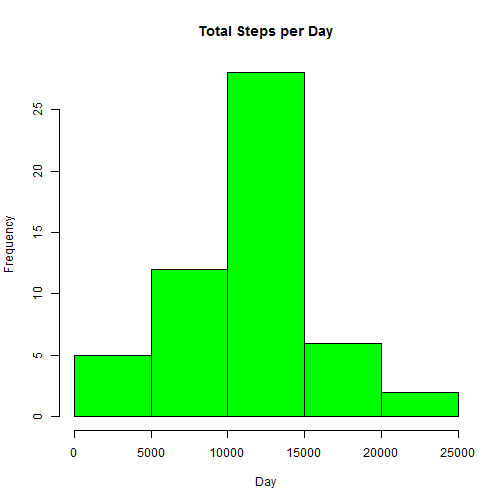
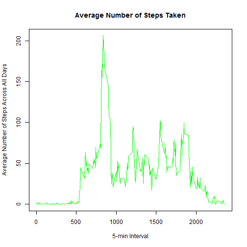
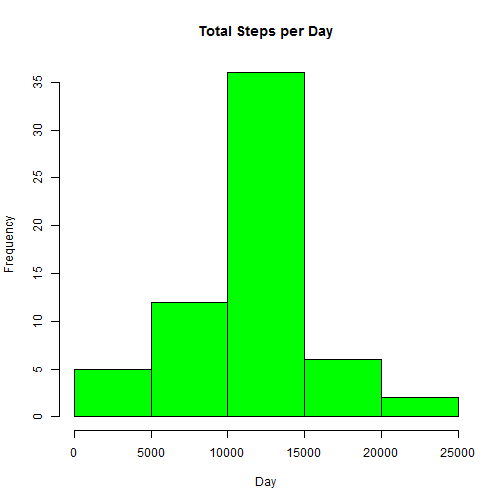

## Setup Environment

Enable **echo = TRUE** so people can view code presented in markdown


```r
library(knitr)
opts_chunk$set(echo = TRUE, results = 'hold')
```

We will also load required packages

```r
library(lubridate)
library(lattice)
```

## Loading and preprocessing the data

Load the data (i.e. read.csv())


```r
activity <- read.csv("activity.csv")
```

Process/transform the data (if necessary) into a format suitable for your analysis


```r
activity$date <- as.Date(activity$date, format = "%Y-%m-%d")
```

## What is mean total number of steps taken per day?

>Make a histogram of the total number of steps taken each day

Calculate the total number of steps taken per day


```r
# Daily step sum that excludes NA values
dss <- aggregate(steps ~ date, data = activity, sum, na.rm = TRUE)
colnames(dss) <- c("Date", "Steps")
```

If you do not understand the difference between a histogram and a barplot, research the difference between them. Make a histogram of the total number of steps taken each day


```r
hist(dss$Steps, main = "Total Steps per Day", xlab = "Day", col = "green")
```

 


>Calculate and report the mean and median of the total number of steps taken per dayy

Mean


```r
dss.mean <- mean(round(dss$Steps,0))
```


```
## [1] 10766.19
```

Median


```r
dss.median <- median(round(dss$Steps,0))
```


```
## [1] 10765
```

## What is the average daily activity pattern?

>Make a time series plot (i.e. type = “l”) of the 5-minute interval (x-axis) and the average number of steps taken, averaged across all days (y-axis)

Mean steps


```r
ts.step <- tapply(activit$steps, activity$interval, mean, na.rm = TRUE)
```

```
## Error in tapply(activit$steps, activity$interval, mean, na.rm = TRUE): object 'activit' not found
```

Generate plot


```r
plot(row.names(ts.step),ts.step,type = "l", 
     xlab = "5-min Interval",
     ylab = "Average Number of Steps Across All Days", 
     main = "Average Number of Steps Taken",
     col = "green")
```

 

>Which 5-minute interval, on average across all the days in the dataset, contains the maximum number of steps?

Use which.max to find max 5-minute interval


```r
max.5 <- which.max(ts.step$steps)
```

```
## Error in ts.step$steps: $ operator is invalid for atomic vectors
```


```
## [1] "835"
```

## Imputing missing values

Note that there are a number of days/intervals where there are missing values (coded as NA). The presence of missing days may introduce bias into some calculations or summaries of the data.

>Calculate and report the total number of missing values in the dataset (i.e. the total number of rows with NAs)

Sum all NA values


```r
activity.NA <- sum(is.na(activity$steps))
```


```
## [1] 2304
```

>Devise a strategy for filling in all of the missing values in the dataset. The strategy does not need to be sophisticated. For example, you could use the mean/median for that day, or the mean for that 5-minute interval, etc.

Replace NA with mean values for that day


```r
# generate array of mean steps per interval
mean.steps <- aggregate(steps ~ interval, data = activity, mean)

# create NA placeholder
NAs <- numeric()

# loop through all ativity set
for (i in 1:nrow(activity)) {
  
    # create placefolder for all activity dataset that includes NA values
    ph <- activity[i, ]
    
    if (is.na(ph$steps)) {
        # match interval in newly created activity placeholder with aggreagated median array and replace
        steps <- subset(mean.steps, interval == ph$interval)$steps
    } else {
        steps <- ph$steps
    }
    
    # insert median step replacement in NA array placeholder
    NAs <- c(NAs, steps)
}
```


>Create a new dataset that is equal to the original dataset but with the missing data filled in.


```r
# Create a new activity dataset with replaced NA values with mean steps for each interval
activity2 <- activity
activity2$steps <- NAs
```

>Make a histogram of the total number of steps taken each day and Calculate and report the mean and median total number of steps taken per day. Do these values differ from the estimates from the first part of the assignment? What is the impact of imputing missing data on the estimates of the total daily number of steps?


```r
dss2 <- aggregate(steps ~ date, data = activity2, sum, na.rm = TRUE)
colnames(dss2) <- c("Date","Steps")
```

Histogram of newly created activity dataset


```r
hist(dss2$Steps, main = "Total Steps per Day", xlab = "Day", col = "green")
```

 

Mean


```r
dss2.mean <- mean(dss2$Steps)
```


```
## [1] 10766
```

Median


```r
dss2.median <- median(dss2$Steps)
```


```
## [1] 10766
```

The difference between the mean and median of the original 
dataset compared to the dataset that contained NA values 
replaced with mean values is equal for the mean and differ 
by 1 for the median.

## Are there differences in activity patterns between weekdays and weekends?

For this part the weekdays() function may be of some help here. Use the dataset with the filled-in missing values for this part.

>Create a new factor variable in the dataset with two levels – “weekday” and “weekend” indicating whether a given date is a weekday or weekend day.


```r
wdwe <- matrix(0,nrow(activity),1)
dayname <- weekdays(activity$date)
for (i in 1:nrow(activity)) {
    if (dayname[i] == "Saturday" || dayname[i] == "Sunday") {
        wdwe[i,1] <- "Weekend"
    } else {
        wdwe[i,1] <- "Weekday"
    }
}
activity$wdwe <- wdwe
activity$wdwe <- factor(activity$wdwe)

# steps by day
sbd <- aggregate(steps ~ interval + wdwe, data = activity, mean)
names(sbd) <- c("interval", "wdwe", "steps")
```


>Make a panel plot containing a time series plot (i.e. type = "l") of the 5-minute interval (x-axis) and the average number of steps taken, averaged across all weekday days or weekend days (y-axis). See the README file in the GitHub repository to see an example of what this plot should look like using simulated data.


```r
xyplot(
  steps ~ interval | wdwe,
  type="l",
  data=sbd,
  xlab="Interval",
  ylab="Number of steps",
  layout=c(1,2)
)
```

 
